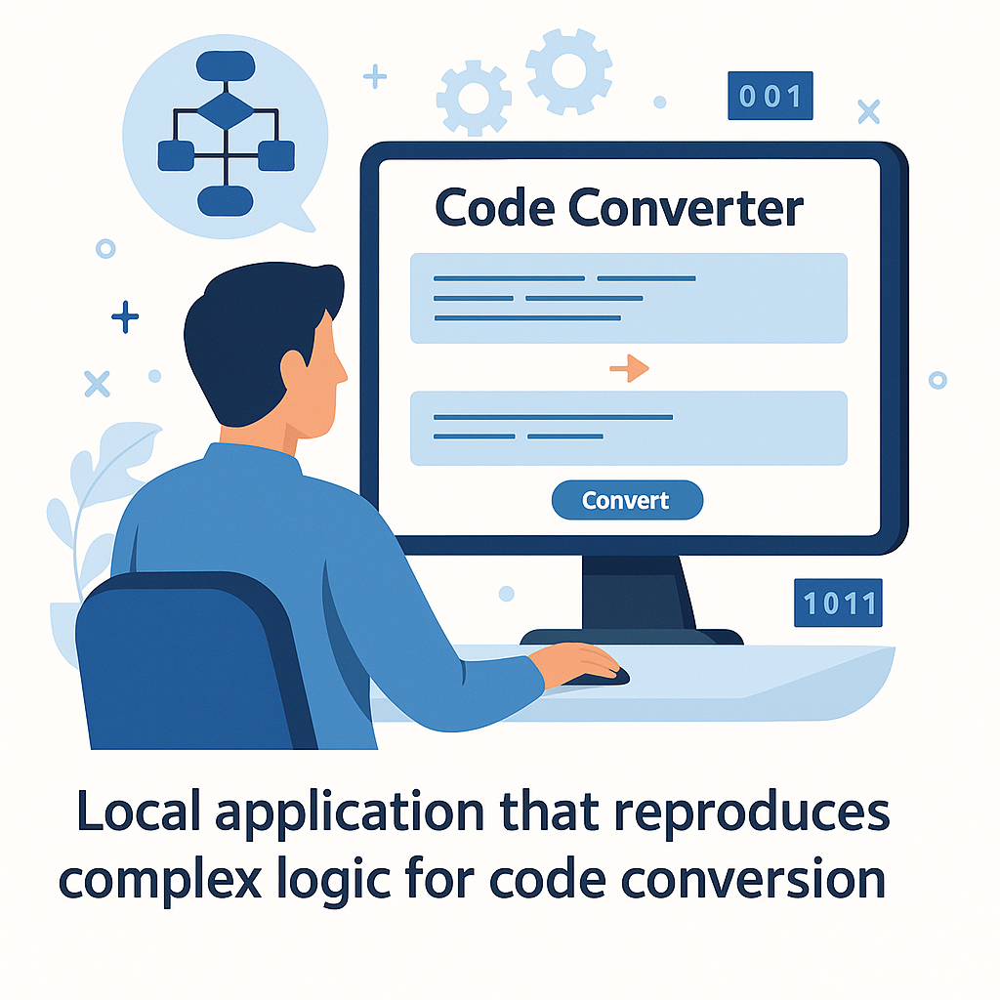

# Code Converter

# Accelerated Code Conversion

# Application UI

The Code Converter accelerator provides a streamlined way to reproduce complex logic in a consistent and repeatable fashion. By reducing the manual effort typically required—and minimizing reliance on specialized tribal knowledge—the tool significantly accelerates the conversion of complex Oracle SQL into Spark SQL or other modern platforms.

Unlike cloud-based AI tools, this application is designed to run locally, ensuring sensitive or proprietary code is never exposed. Its redistributable architecture makes it portable across environments, giving teams a reliable, secure solution for code conversion without introducing external dependencies. The result is faster modernization cycles, reduced risk, and improved consistency in code transformation.
