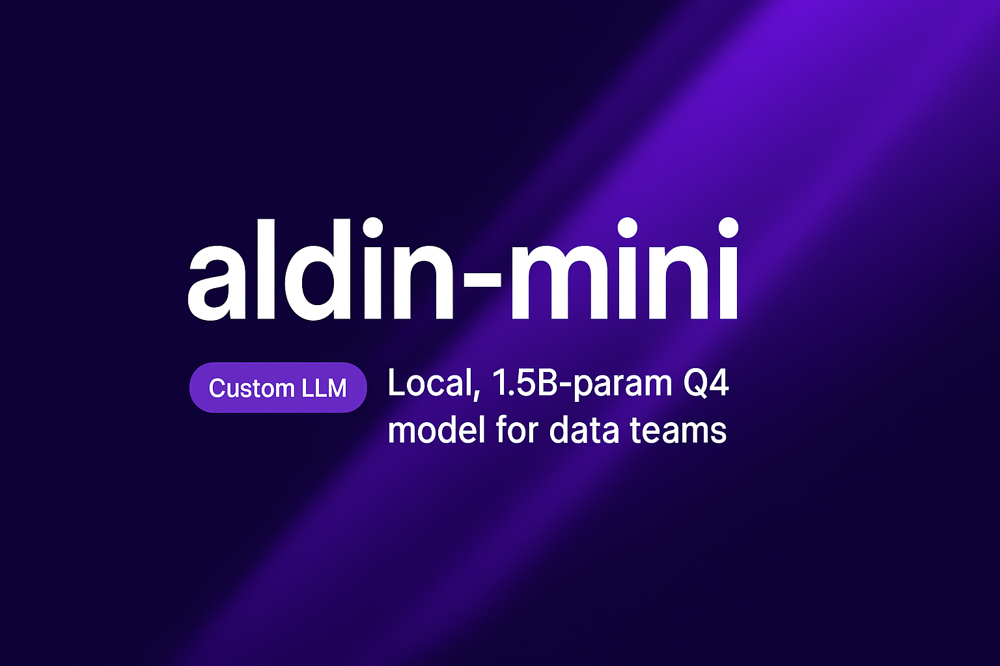

# Model Card — **aldin-mini** (Qwen2.5-1.5B-Instruct, Q4_K_M)

## Overview
- **Purpose:** Lightweight, **local-first** assistant tuned for data teams. Optimized for rapid drafting, analysis support, and **governance-aware** guidance without sending data to external clouds.  
- **Primary domains:** Data Governance, Data Architecture, Analytics/BI, MLOps/AI Engineering, Security/Compliance, Knowledge Management, Developer Experience.  
- **Owner:** *[Salah Mokhayesh]*  

---

## Intended Use
- Drafting: policies, SOPs, runbooks, migration plans, KPI definitions.  
- Analytics co-pilot: SQL generation/explanation, query review, dashboard narratives.  
- Architecture help: schema/contract proposals, modeling trade-offs, cost/perf tips.  
- MLOps: prompt patterns, RAG scaffolds, experiment summaries, light agent plans.  
- Governance & security: redaction patterns, guardrail sketches, audit checklists.

### Not Intended For
- High-stakes decisions without human review.  
- Authoritative legal, security, or compliance determinations.  
- Processing regulated data unless appropriate masking/redaction is applied.

---

## Model Details
- **Base model:** Qwen2.5-1.5B-Instruct (chat-tuned)  
- **Parameters:** ~1.54B  
- **Quantization:** Q4_K_M (GGUF) — ~935 MiB on disk  
- **Context window:** Upstream 32k; configured at 4k for this deployment  
- **Tokenizer:** BPE (Qwen2 family)  
- **Chat format:** `qwen` (supports tool-call style transcripts)

---

## Deployment

!!! info "Runtime"
    **llama_cpp.server** (CPU). Fully local inference; no external network calls by default.

