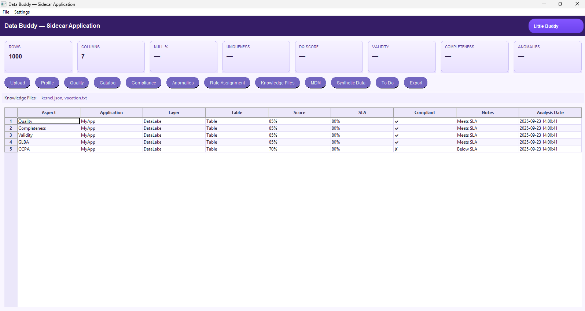
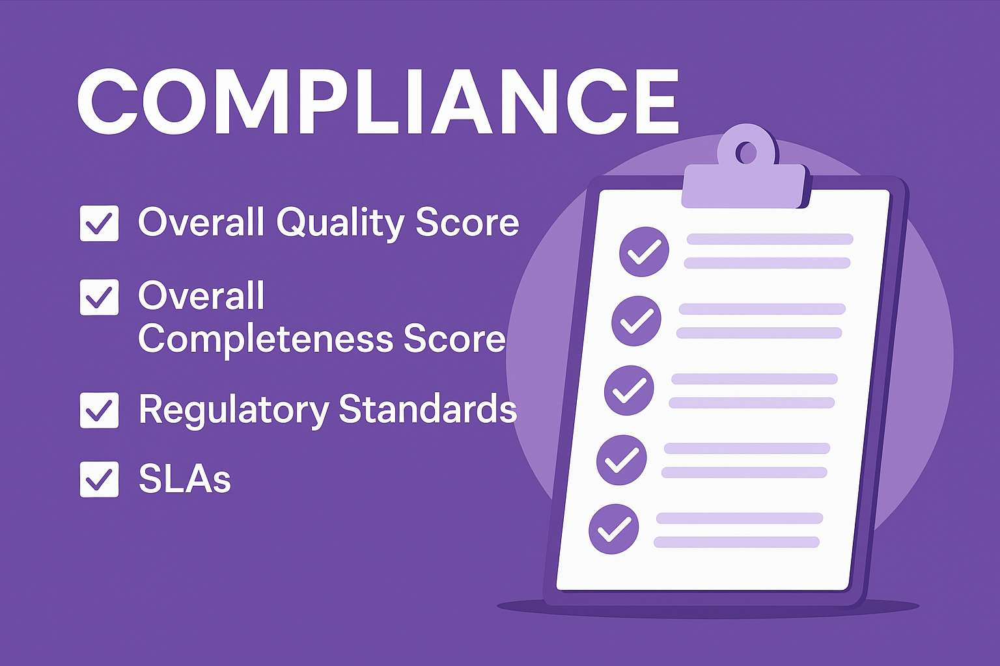

# Compliance

# Advanced Configurable Data Compliance

The Compliance accelerator ensures that organizational policies and regulatory requirements (e.g., GDPR, CCPA, GLBA) are met consistently and automatically.  
By integrating compliance checks directly into the Data Buddy workflow, teams can proactively identify risks, validate against service-level agreements (SLAs), and generate auditable reports without relying on manual intervention.  

This approach reduces compliance overhead, improves confidence during audits, and ensures governance standards are applied in a repeatable, transparent manner.

## Compliance Checks
- **Overall Quality Score** – evaluates the accuracy and reliability of the dataset  
- **Overall Completeness Score** – measures data coverage against required fields  
- **Regulatory Standards** – validates alignment with policies like GDPR, CCPA, GLBA  
- **SLAs** – ensures service-level thresholds and contractual obligations are met  

## Tasks
- Control checks against regulatory and internal standards  
- Evidence capture and packaging for audits  
- Attestation and SLA reports, ready for stakeholders  
