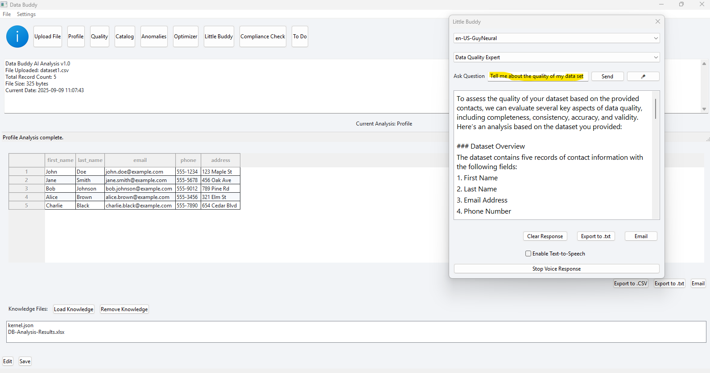

# Conversational AI

## The **Conversational AI** module enables expert-level interactions directly with your data. 

The chatbot can analyze and interact with datasets, reference documentation, or any files uploaded to the Knowledge Files section. By leveraging expert personas, it can not only answer questions but also perform actions on the dataset—such as profiling, compliance checks, or anomaly detection—while explaining its reasoning in context.

This creates a powerful AI copilot for governance tasks, providing guided troubleshooting, policy Q&A, and intelligent recommendations to accelerate data-driven workflows.

## Example UI

## Tasks
- Assess the Quality of my data set 
- Create Features, Stories, Tasks to improve my Data's Quality 
- Recommend Resources per task
- Produce a Roadmap 

