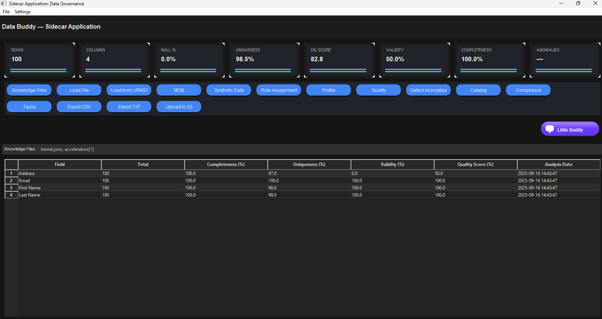

# Data Quality

# High Performance Advanced Data Quality
{ width="600" height="200" }


Ensure trusted data with **configurable rules, scorecards, alerts,** and a light stewardship workflow.

<div class="grid cards" markdown>

- :material-shield-check: **What it does**  
  Evaluate data against rules mapped to standard dimensions (accuracy, completeness, timeliness, consistency, validity, uniqueness). Produce scores, exceptions, and evidence.

- :material-speedometer: **Why it matters**  
  Prevent downstream failures, protect analytics & AI, and demonstrate compliance with measurable SLAs.

- :material-database-arrow-right: **Typical inputs**  
  Tables or files (CSV/Parquet), optional filters/partitions, rule packs.

- :material-file-chart: **Outputs**  
  Scorecards, exceptions, breach alerts, audit-ready evidence (CSV/JSON).

</div>

---

## Example (UI)

<figure markdown>
  { .screenshot }
  <figcaption>Data Buddy — Quality analysis with dimension scores, exceptions, and rules per field.</figcaption>
</figure>

---

## Quickstart

=== "UI"
    1. Select a **table/file**, then click **Quality**.  
    2. Pick a **rule pack** (or start with defaults per dimension).  
    3. Review **scores & exceptions** → export CSV/JSON for evidence.

=== "CLI (placeholder)"
    ```bash
    # Replace with your actual entry point when wired up
    python -m databuddy dq run data/dataset.csv \
      --rules dq/rules.yml \
      --scorecard out/dq/scorecard.csv \
      --exceptions out/dq/exceptions.csv
    ```

---

## Rule packs (example)

```yaml
# dq/rules.yml
rules:
  - name: email_valid
    dimension: validity
    expr: "email ~ '^[^@]+@[^@]+\\.[^@]+$'"
    threshold: 0.99

  - name: phone_digits
    dimension: consistency
    expr: "length(regexp_replace(phone, '[^0-9]', '')) BETWEEN 10 AND 15"
    threshold: 0.98

  - name: address_not_blank
    dimension: completeness
    expr: "address IS NOT NULL AND trim(address) <> ''"
    threshold: 0.999
