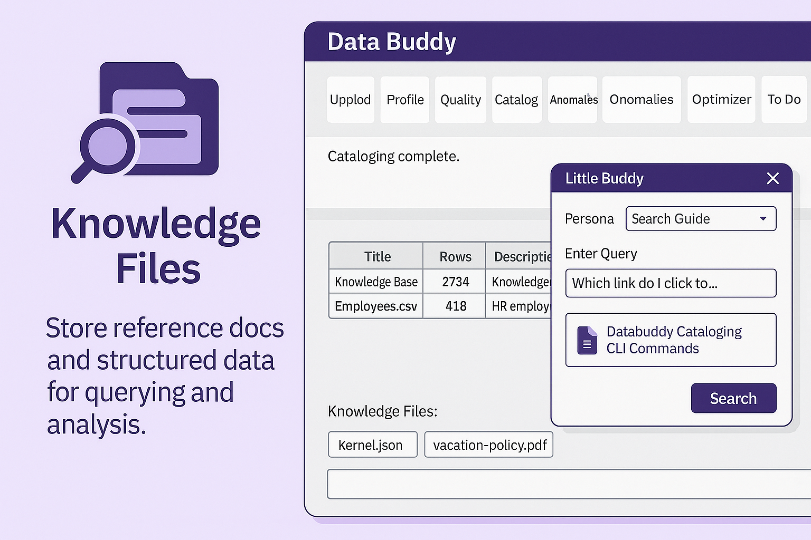
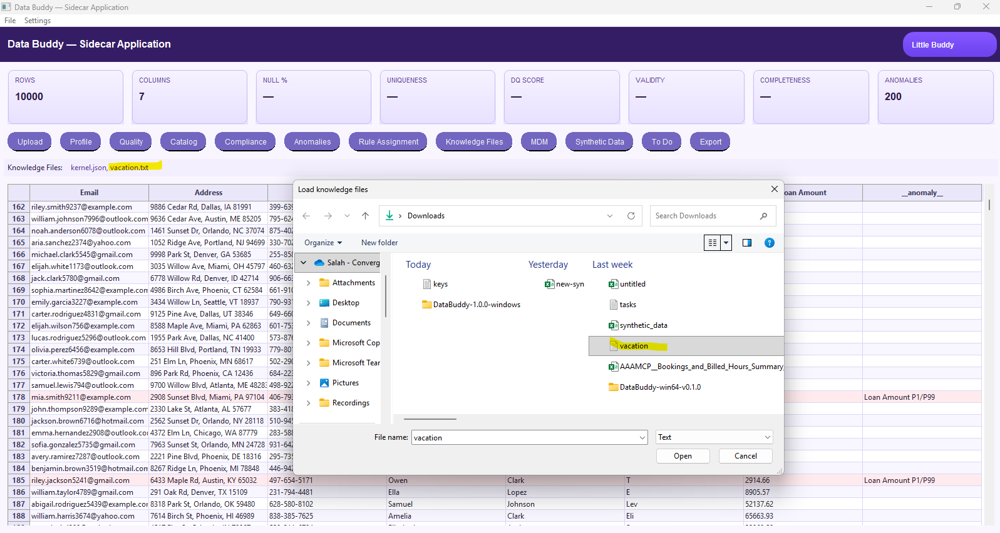

# Knowledge Files

---

# Reference Documentation integrated with Expert level Conversational AI Analysis and Insights
Turn your documents into an on-demand expert. **Upload referenceable content** (policies, playbooks, specs, spreadsheets, PDFs, markdown, etc.) and let a **conversational AI** answer questions, summarize, generate checklists, and point you to the exact source passages.

<figure markdown>
  { .screenshot }
  <figcaption>Load a knowledge pack, then **ask in natural language** (e.g., “What are my vacation days?”). The assistant answers from your files and can export the response.</figcaption>
</figure>

---
Turn your documents into an on-demand expert. **Upload referenceable content** (policies, playbooks, specs, spreadsheets, PDFs, markdown, etc.) and let a **conversational AI** answer questions, summarize, generate checklists, and point you to the exact source passages.

<div class="grid cards" markdown>

- :material-book-open-page-variant: **What it does**  
  Indexes your docs and uses retrieval-augmented generation (RAG) so answers come **from your content**, not generic internet text.

- :material-account-tie: **Why it matters**  
  Gives teams **expert-level insight in seconds**, reduces context switching, and scales tribal knowledge.

- :material-file-upload: **Typical inputs**  
  Markdown, PDF, DOCX, XLSX/CSV, HTML, text notes, and curated exports from catalogs/BI.

- :material-shield-check: **Outputs**  
  Source-grounded answers, summaries, and snippets you can export to CSV/TXT for evidence.

</div>

---

## Example (UI)

<figure markdown>
  { .screenshot }
  <figcaption>Load a knowledge pack, then **ask in natural language** (e.g., “What are my vacation days?”). The assistant answers from your files and can export the response.</figcaption>
</figure>

---

## Quickstart

=== "UI"
    1. Click **Load Knowledge** and select files or a folder.  
    2. Open **Little Buddy** and **Ask a question** (e.g., “Summarize our retention policy”).  
    3. **Export** the response (CSV/TXT) or paste into tickets and docs.

=== "CLI (placeholder)"
    ```bash
    # Index a folder of documents
    python -m databuddy kb index ./knowledge --db out/kb.index

    # Ask a question grounded in that knowledge base
    python -m databuddy chat --kb out/kb.index \
      --ask "List our data quality SLAs and escalation path"
    ```

---

## Recommended structure

```text
knowledge/
  glossary/
  policies/
  playbooks/
  runbooks/
  reference/
