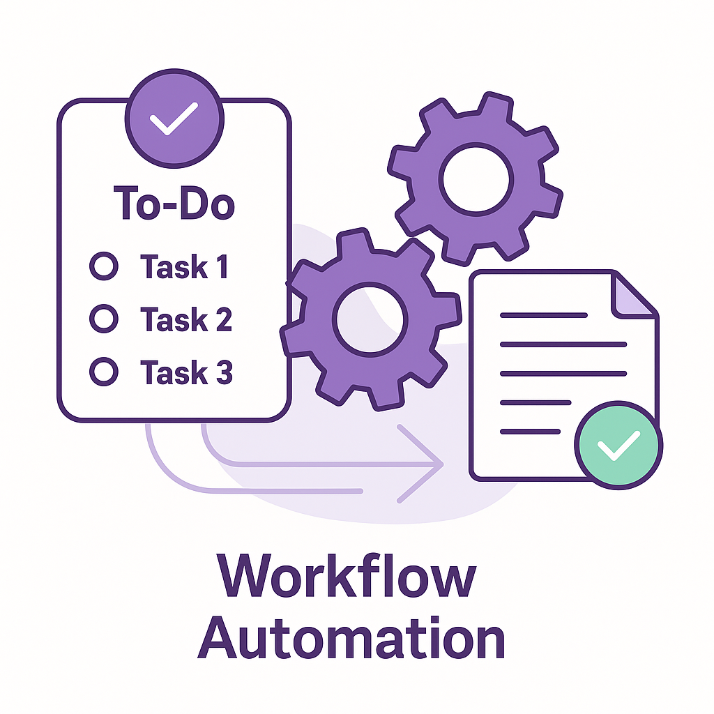
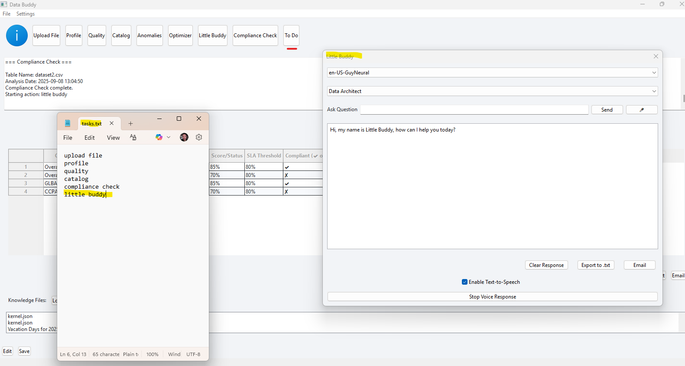

# Workflow Automation

# Workflow Automation Example UI

Workflow Automation enables teams to execute defined actions in the correct order, automatically, based on a **To-Do list of tasks**.  
This approach ensures repeatability, reduces manual oversight, and guarantees that key steps—such as profiling, quality checks, anomaly detection, and compliance—run consistently according to business-defined workflows.  

By orchestrating tasks in sequence, Workflow Automation streamlines governance processes, enforces standards, and saves valuable time across teams.

## Key Features
- **Task orchestration** – execute profiling → quality → anomalies → reporting automatically  
- **Defined To-Do lists** – pre-configured task lists drive execution order  
- **Scheduling & CI/CD** – run workflows on schedule or integrate into pipelines  
- **Notifications** – alert stakeholders when workflows complete or issues arise  
