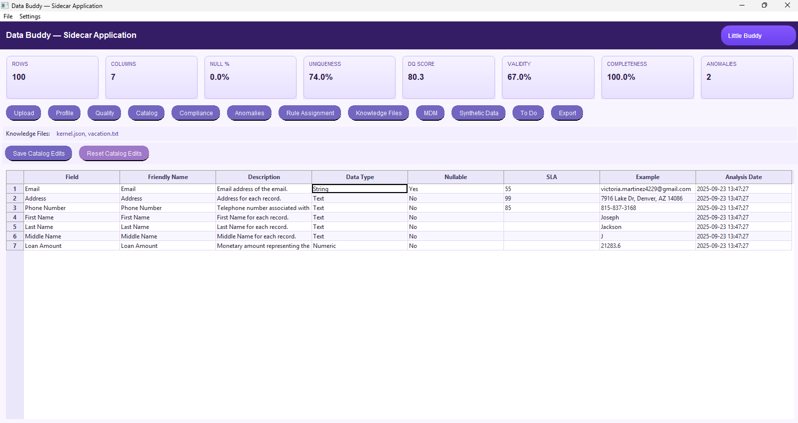

# Data Cataloging

Build a **living data catalog in minutes** from any uploaded or connected dataset. Data Buddy uses AI to propose **Business Terms, Descriptions, Definitions, Data Types, Patterns, Example Data, Privacy Classifications, and Encryption Requirements** with **consistent terminology and expert tone**—so you can scale metadata management, enable stewardship, and improve **data quality & compliance** with **defined and configurable SLAs**.

<div class="grid cards" markdown>

- :material-book-open-page-variant: **What it does**  
  Auto-generates field-level and table-level metadata (business + technical), applies privacy classifications, and suggests encryption requirements. Supports edit/approve workflows.

- :material-account-tie: **Why it matters**  
  Produces **consistent, steward-ready catalog entries** fast, accelerates onboarding, and makes downstream **DQ and compliance** measurable through SLAs.

- :material-database-arrow-right: **Typical inputs**  
  Connected tables (warehouse/lake) or uploaded files (CSV/Parquet).

- :material-file-chart: **Outputs**  
  Glossary terms, field dictionaries, classifications, SLA targets, and exportable evidence (CSV/JSON) for governance records.

</div>

---

## Example (UI)

<figure markdown>
  { .screenshot }
  <figcaption>AI-generated catalog entries from a sample dataset—business terms, descriptions, definitions, types, patterns, example data, privacy classification, and encryption requirement.</figcaption>
</figure>

<figure markdown>
  { .screenshot }
  <figcaption>Configurable **SLA targets** (e.g., overall Quality, Completeness, Validity) are captured alongside the catalog to drive Data Quality and compliance reporting.</figcaption>
</figure>

---

## Quickstart

=== "UI"
    1. **Upload** a file or select a **connected table**.  
    2. Click **Catalog** → Data Buddy **infers** the dictionary + classifications.  
    3. Switch to **Edit** to refine terms or add examples; set **SLA targets**.  
    4. **Save / Export** to CSV/JSON or sync to your enterprise catalog.

=== "CLI (placeholder)"
    ```bash
    # Generate a catalog from a file
    python -m databuddy catalog infer data/dataset.csv \
      --out out/catalog/catalog.csv

    # Apply/update SLA targets
    python -m databuddy catalog sla \
      --catalog out/catalog/catalog.csv \
      --sla "quality=0.90,completeness=0.95,validity=0.90" \
      --out out/catalog/catalog-with-sla.csv
    ```

---

## What gets captured

- **Business Term** & **Friendly Name**  
- **Description** & **Definition** (business-grade wording)  
- **Data Type** & **Pattern** (regex, format hints)  
- **Example Data**  
- **Data Privacy Classification** (e.g., Public, Internal, Confidential, PII)  
- **Encryption Requirement**  
- **SLA Targets** (Quality, Completeness, Validity — configurable)

> Tip: keep short, action-oriented definitions; use example values that illustrate valid formats.

---

## Governance & stewardship

- Assign **Owners/Stewards (RACI)** at domain or dataset level.  
- Track **lineage** to connect catalog → DQ rules → dashboards.  
- Use **review queues** for changes; export **evidence bundles** for audits.  
- Re-run inference when schemas evolve; differences become **catalog PRs**.

---

## Suggested next steps

- Turn catalog fields into **Data Quality** rules and scorecards.  
- Surface definitions in **Knowledge Files** so conversational AI can answer using your catalog.  
- Schedule periodic **profiling** and **anomaly detection** to keep SLAs on track.


