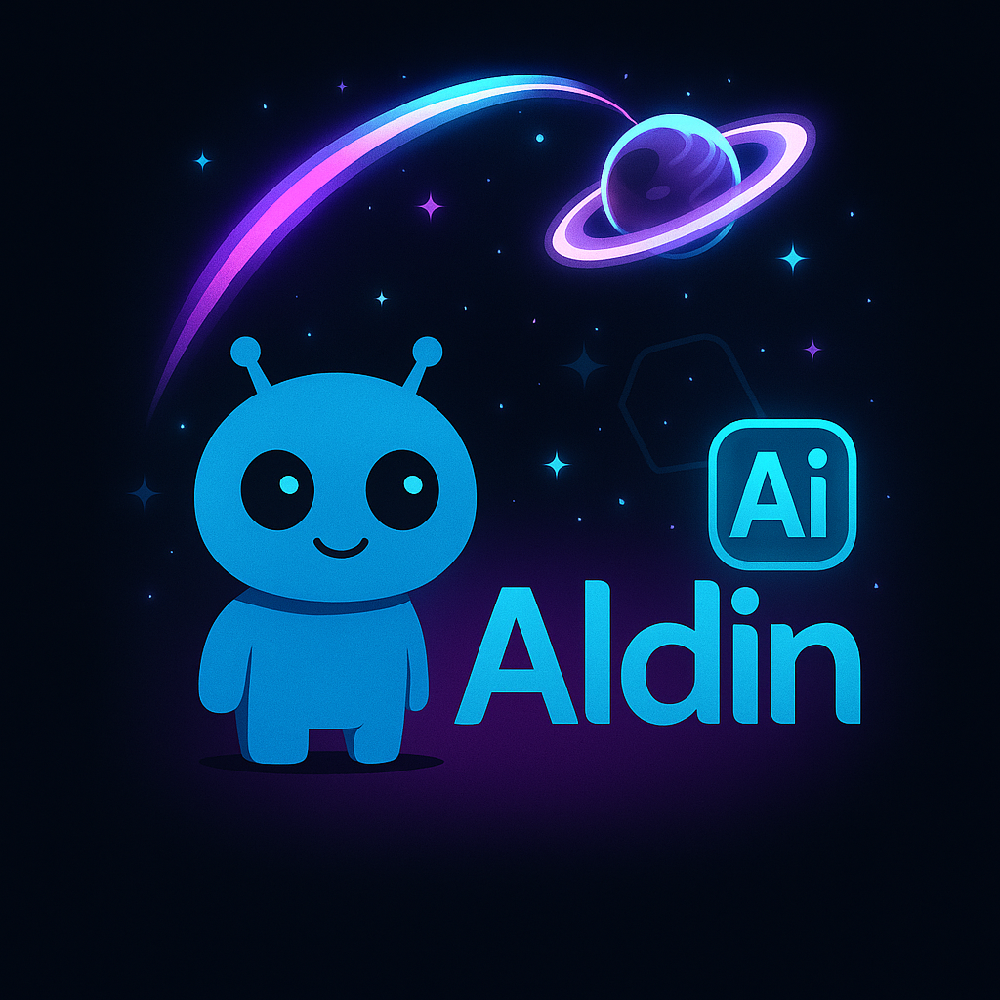

---
title: Home
hide:
  - toc
---

<!-- =================== HERO =================== -->

  

    
Custom Built Solutions

    <h1 class="hero__title">Aldin AI Accelerators</h1>
    

      Customized, reusable components for data & AI delivery — designed to help teams ship reliable, safe and fast.
    

    

      <a class="md-button md-button--primary" href="data-governance/index.md">View Data Governance</a>
      <a class="md-button md-button--secondary" href="#accelerators">Explore Accelerators</a>
    

  

  

    
  

<!-- ================ /HERO ===================== -->

<!-- Keep your existing sections below (accelerators grid, etc.) -->

---

## Explore the accelerators { #accelerators }

- :material-chat-processing: **Prompt Engineering**  
  Patterns for structured prompts, grounding, guardrails, and evaluation to make LLM features **reliable, safe, and repeatable**.  
  [:octicons-arrow-right-16: Open](prompt-engineering//)

- :material-code-json: **Code Converter**  
  Oracle/PLSQL → Spark SQL utilities.  
  [:octicons-arrow-right-16: Open](code-converter//)

- :material-account-cog: **Data Genius**  
  Profiling, DQ, cataloging, anomalies, compliance, automation, conversational AI, knowledge files.  
  [:octicons-arrow-right-16: Open](data-buddy//)

- :material-database-cog: **MDM**  
  Matching, survivorship, reference data flows.  
  [:octicons-arrow-right-16: Open](mdm//)

- :material-puzzle: **Sidecar Apps**  
  Small UIs/services to extend your platform.  
  [:octicons-arrow-right-16: Open](sidecar-applications//)

- :material-robot-excited: **Synthetic Data Generator**  
  Privacy-preserving test data at scale.  
  [:octicons-arrow-right-16: Open](synthetic-data-generator//)

