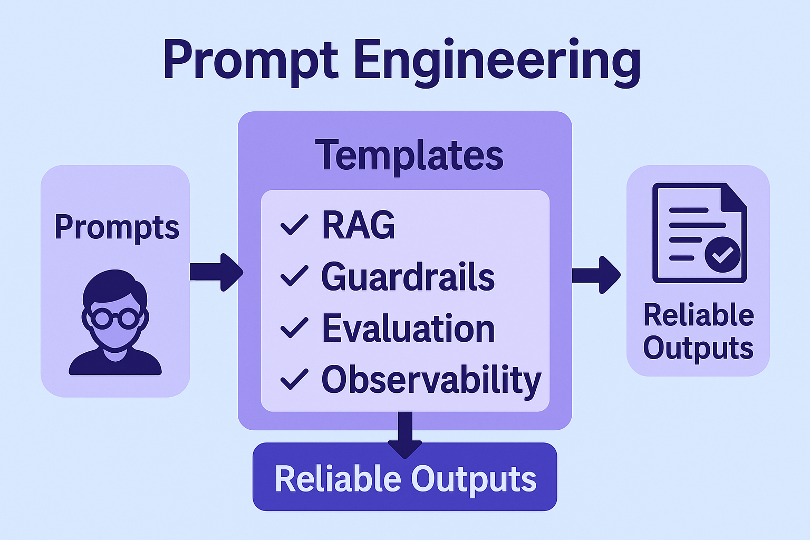

# Prompt Engineering

Prompt Engineering provides a systematic way to design prompts and context pipelines that are **accurate, safe, and testable**—ensuring conversational and generative features behave like products, not demos.  

Well written prompts can leverage the expertise of a given subject area or SME to produce consistent, repeatable complex actions. This reduces variability, accelerates adoption, and helps capture tribal knowledge in a structured and reusable form.

## What it covers
- **Structured prompts & templates** – roles, constraints, step-by-step formats.
- **Grounding & retrieval (RAG)** – cite sources, control drift, reduce hallucination.
- **Guardrails** – instruction hierarchy, input/output validation, red-team prompts.
- **Evaluation** – golden sets, rubric scoring, regression tests in CI.
- **Observability** – prompt/version tracking, cost/latency metrics, feedback loops.
