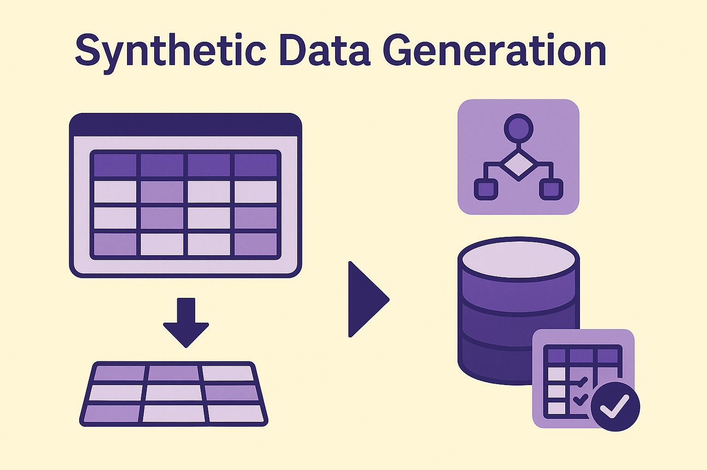

# Synthetic Data Generator

  

## Overview
Synthetic data generation enables the creation of production-like datasets that preserve the statistical properties of real data while eliminating privacy concerns. By uploading or connecting to a dataset, synthetic data can be reproduced at near-production quality levels.

## Benefits
- **Privacy-Preserving**: Maintain compliance by removing sensitive data while keeping analytical value.  
- **Configurable**: Customize rules, ranges, and field values to match business needs.  
- **Redistributable**: Share and replicate synthetic datasets across environments, layers, or buckets without risk.  

This approach accelerates development, testing, and analytics by providing safe, scalable, and reusable data assets.
